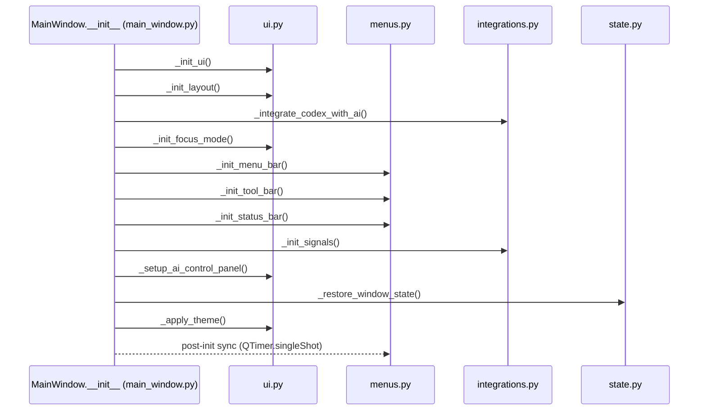

# ANE-0204 — MainWindow “初始化顺序图”与“依赖注入点”

本文件用于给 Epic 6.1 的 MainWindow 拆分提供可追溯的初始化顺序说明与依赖注入（DI）入口，便于后续维护与继续拆分。

## 代码落点（按职责拆分）
- `src/gui/main_window.py`：**初始化编排器**（只保留 `MainWindow.__init__` 与依赖注入入口）
- `src/gui/main_window_parts/ui.py`：layout / focus mode / theme / UI 基础初始化
- `src/gui/main_window_parts/menus.py`：menu / toolbar / shortcuts / 面板与工具栏切换
- `src/gui/main_window_parts/dialogs.py`：各类对话框打开入口（Preferences/Find/Import/Export/AI 设置等）
- `src/gui/main_window_parts/integrations.py`：signals、AI wiring、Codex wiring、controller wiring、索引调度相关回调
- `src/gui/main_window_parts/state.py`：window/layout state restore/save、`closeEvent`

## 初始化顺序（文字版）
`MainWindow.__init__` 内的关键阶段：

1) **注入外部依赖（DI）**
   - `config: Config`
   - `shared: Shared`
   - `project_manager: ProjectManager`
   - 可选：`codex_manager / reference_detector / prompt_function_registry`

2) **创建内部组件（当前仍在 MainWindow 内部 new）**
   - `ProjectController`
   - （可选）`EnhancedAIManager` + `AICompletionControlPanel`（失败会被捕获并降级）
   - `TaskManager` / `IndexScheduler`（并绑定到 `Shared` 与 `ProjectManager`）
   - `ThemeManager`
   - 统计更新的 `QTimer`

3) **UI/功能初始化调用链（拆分后仍保持原调用顺序）**
   - `ui.py`：`_init_ui()` → `_init_layout()` → `_init_focus_mode()` → `_setup_ai_control_panel()` → `_apply_theme()`
   - `integrations.py`：`_integrate_codex_with_ai()` → `_init_signals()`
   - `menus.py`：`_init_menu_bar()` → `_init_tool_bar()` → `_init_status_bar()`（以及 post-init 的菜单状态同步）
   - `state.py`：`_restore_window_state()`

4) **post-init 同步（延迟执行）**
   - `QTimer.singleShot(...)` 同步面板菜单状态与主题菜单勾选状态。

## 初始化顺序图（Mermaid）

## 依赖注入点（DI Points）
### 1) 构造函数参数（最明确的 DI 入口）
`MainWindow.__init__(config, shared, project_manager, codex_manager=None, reference_detector=None, prompt_function_registry=None)`

- `config / shared / project_manager`：主窗口的核心依赖（启动链路必须提供）
- `codex_manager / reference_detector / prompt_function_registry`：Codex 与引用检测、Prompt registry 的可选注入点
  - 若提供，会被注册到 `Shared`，供其他面板/服务使用

### 2) 运行期绑定/替换（后续扩展点）
当前仍在 `MainWindow.__init__` 内部创建并绑定的对象，是后续继续 DI 化的自然入口：
- `TaskManager` / `IndexScheduler`：若未来需要可测试性或替换实现，可改为由上层注入或工厂创建
- `ThemeManager`：同上
- AI 管理器初始化：目前使用 `try/except` 降级策略，未来可改为策略/工厂注入

### 3) 职责模块化后的“改动入口”
- 想改 **菜单/工具栏/快捷键**：优先看 `src/gui/main_window_parts/menus.py`
- 想改 **对话框入口/设置面板**：优先看 `src/gui/main_window_parts/dialogs.py`
- 想改 **AI/Codex 连接与信号回调**：优先看 `src/gui/main_window_parts/integrations.py`
- 想改 **窗口状态持久化**：优先看 `src/gui/main_window_parts/state.py`
- 想改 **布局/专注模式/主题应用**：优先看 `src/gui/main_window_parts/ui.py`

## 验收建议
- 自动化：`python -m compileall -q src` + `pytest -q`
- 手工（需要可运行 GUI 环境）：运行 `src/main.py`，按 `docs/qa/top10-flows.md` 覆盖“启动→打开项目→编辑→保存→退出”。

